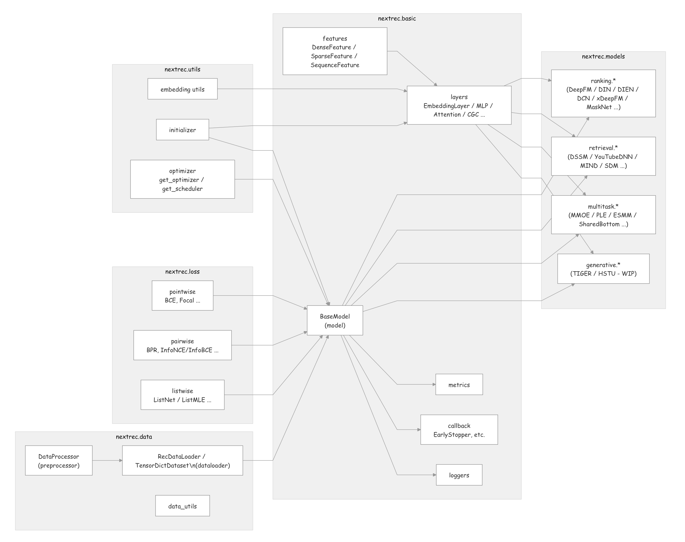

<p align="center">

<p>

<div align="center">


English | [中文文档](README_zh.md)

**A Unified, Efficient, and Scalable Recommendation System Framework**

</div>

## Table of Contents

- [Introduction](#introduction)
- [Installation](#installation)
- [Architecture](#architecture)
- [5-Minute Quick Start](#5-minute-quick-start)
- [CLI Usage](#cli-usage)
- [Platform Compatibility](#platform-compatibility)
- [Supported Models](#supported-models)
- [Contributing](#contributing)

## Introduction

NextRec is a modern recommendation system framework built on PyTorch, providing researchers and engineering teams with a fast modeling, training, and evaluation experience. The framework adopts a modular design with rich built-in model implementations, data processing tools, and engineering-ready training components, covering various recommendation scenarios. NextRec provides easy-to-use interfaces, command-line tools, and tutorials, enabling recommendation algorithm learners to quickly understand model architectures and train and infer models at the fastest speed.

## Why NextRec

- **Unified feature engineering & data pipeline**: NextRec provides Dense/Sparse/Sequence feature definitions, persistent DataProcessor, and batch-optimized RecDataLoader, matching the model training and inference process based on offline `parquet/csv` features in industrial big-data Spark/Hive scenarios.
- **Multi-scenario recommendation capabilities**: Covers ranking (CTR/CVR), retrieval, multi-task learning and other recommendation/marketing models, with a continuously expanding model zoo.
- **Developer-friendly experience**: Supports stream preprocessing/distributed training/inference for various data formats (`csv/parquet/pathlike`), GPU acceleration and visual metric monitoring, facilitating experiments for business algorithm engineers and recommendation algorithm learners.
- **Flexible command-line tool**: Through configuring training and inference config files, start training and inference processes with one command `nextrec --mode=train --train_config=train_config.yaml`, facilitating rapid experiment iteration and agile deployment.
- **Efficient training & evaluation**: NextRec's standardized training engine comes with various optimizers, learning rate schedulers, early stopping, model checkpoints, and detailed log management built-in, ready to use out of the box.

## Architecture

NextRec adopts a modular and low-coupling engineering design, enabling full-pipeline reusability and scalability across data processing → model construction → training & evaluation → inference & deployment. Its core components include: a Feature-Spec-driven Embedding architecture, the BaseModel abstraction, a set of independent reusable Layers, a unified DataLoader for both training and inference, and a ready-to-use Model Zoo.



> The project borrows ideas from excellent open-source rec libraries. Early layers referenced [torch-rechub](https://github.com/datawhalechina/torch-rechub) but have been replaced with in-house implementations. torch-rechub remains mature in architecture and models; the author contributed a bit there—feel free to check it out.

---

## Installation

You can quickly install the latest NextRec via `pip install nextrec`; Python 3.10+ is required.


## Tutorials

We provide multiple examples in the `tutorials/` directory, covering ranking, retrieval, multi-task, and data processing scenarios:

- [movielen_ranking_deepfm.py](/tutorials/movielen_ranking_deepfm.py) — DeepFM model training example on MovieLens 100k dataset
- [example_ranking_din.py](/tutorials/example_ranking_din.py) — DIN deep interest network training example on e-commerce dataset
- [example_multitask.py](/tutorials/example_multitask.py) — ESMM multi-task learning training example on e-commerce dataset
- [movielen_match_dssm.py](/tutorials/example_match_dssm.py) — DSSM retrieval model example trained on MovieLens 100k dataset
- [run_all_ranking_models.py](/tutorials/run_all_ranking_models.py) — Quickly verify the availability of all ranking models
- [run_all_multitask_models.py](/tutorials/run_all_multitask_models.py) — Quickly verify the availability of all multi-task models
- [run_all_match_models.py](/tutorials/run_all_match_models.py) — Quickly verify the availability of all retrieval models

If you want to learn more details about the NextRec framework, we also provide Jupyter notebooks to help you understand:

- [How to get started with the NextRec framework](/tutorials/notebooks/en/Hands%20on%20nextrec.ipynb)
- [How to use the data processor for data preprocessing](/tutorials/notebooks/en/Hands%20on%20dataprocessor.ipynb)

## 5-Minute Quick Start

We provide a detailed quick start guide and paired datasets to help you become familiar with different features of the NextRec framework. We provide a test dataset from an e-commerce scenario in the `datasets/` path, with data examples as follows:

| user_id | item_id | dense_0     | dense_1     | dense_2     | dense_3    | dense_4     | dense_5     | dense_6     | dense_7     | sparse_0 | sparse_1 | sparse_2 | sparse_3 | sparse_4 | sparse_5 | sparse_6 | sparse_7 | sparse_8 | sparse_9 | sequence_0                                               | sequence_1                                                | label |
|--------|---------|-------------|-------------|-------------|------------|-------------|-------------|-------------|-------------|----------|----------|----------|----------|----------|----------|----------|----------|----------|----------|-----------------------------------------------------------|-----------------------------------------------------------|-------|
| 1      | 7817    | 0.14704075  | 0.31020382  | 0.77780896  | 0.944897   | 0.62315375  | 0.57124174  | 0.77009535  | 0.3211029   | 315      | 260      | 379      | 146      | 168      | 161      | 138      | 88       | 5        | 312      | [170,175,97,338,105,353,272,546,175,545,463,128,0,0,0]   | [368,414,820,405,548,63,327,0,0,0,0,0,0,0,0]              | 0     |
| 1      | 3579    | 0.77811223  | 0.80359334  | 0.5185201   | 0.91091245 | 0.043562356 | 0.82142705  | 0.8803686   | 0.33748195 | 149      | 229      | 442      | 6        | 167      | 252      | 25       | 402      | 7        | 168      | [179,48,61,551,284,165,344,151,0,0,0,0,0,0,0]            | [814,0,0,0,0,0,0,0,0,0,0,0,0,0,0]                          | 1     |

Next, we'll use a short example to show you how to train a DIN model using NextRec. DIN (Deep Interest Network) is from Alibaba's 2018 KDD Best Paper, used for CTR prediction scenarios. You can also directly execute `python tutorials/example_ranking_din.py` to run the training and inference code.

After starting training, you can view detailed training logs in the `nextrec_logs/din_tutorial` path.

```python
import pandas as pd

from nextrec.models.ranking.din import DIN
from nextrec.basic.features import DenseFeature, SparseFeature, SequenceFeature

df = pd.read_csv('dataset/ranking_task.csv')

for col in df.columns and 'sequence' in col: # csv loads lists as text; convert them back to objects
    df[col] = df[col].apply(lambda x: eval(x) if isinstance(x, str) else x)

# Define feature columns
dense_features = [DenseFeature(name=f'dense_{i}', input_dim=1) for i in range(8)]

sparse_features = [SparseFeature(name='user_id', embedding_name='user_emb', vocab_size=int(df['user_id'].max() + 1), embedding_dim=32), SparseFeature(name='item_id', embedding_name='item_emb', vocab_size=int(df['item_id'].max() + 1), embedding_dim=32),]

sparse_features.extend([SparseFeature(name=f'sparse_{i}', embedding_name=f'sparse_{i}_emb', vocab_size=int(df[f'sparse_{i}'].max() + 1), embedding_dim=32) for i in range(10)])

sequence_features = [
    SequenceFeature(name='sequence_0', vocab_size=int(df['sequence_0'].apply(lambda x: max(x)).max() + 1), embedding_dim=32, padding_idx=0, embedding_name='item_emb'),
    SequenceFeature(name='sequence_1', vocab_size=int(df['sequence_1'].apply(lambda x: max(x)).max() + 1), embedding_dim=16, padding_idx=0, embedding_name='sparse_0_emb'),]

mlp_params = {
    "dims": [256, 128, 64],
    "activation": "relu",
    "dropout": 0.3,
}

model = DIN(
    dense_features=dense_features,
    sparse_features=sparse_features,
    sequence_features=sequence_features,
    mlp_params=mlp_params,
    attention_hidden_units=[80, 40],
    attention_activation='sigmoid',
    attention_use_softmax=True,
    target=['label'],                                     # target variable
    device='mps',                                         
    embedding_l1_reg=1e-6,
    embedding_l2_reg=1e-5,
    dense_l1_reg=1e-5,
    dense_l2_reg=1e-4,
    session_id="din_tutorial",                            # experiment id for logs
)

# Compile model with optimizer and loss
model.compile(
            optimizer = "adam",
            optimizer_params = {"lr": 1e-3, "weight_decay": 1e-5},
            loss = "focal",
            loss_params={"gamma": 2.0, "alpha": 0.25},
        )

model.fit(
    train_data=df,
    metrics=['auc', 'gauc', 'logloss'],  # metrics to track
    epochs=3,
    batch_size=512,
    shuffle=True,
    user_id_column='user_id'             # used for GAUC
)

# Evaluate after training
metrics = model.evaluate(
    df,
    metrics=['auc', 'gauc', 'logloss'],
    batch_size=512,
    user_id_column='user_id'
)
```

## CLI Usage

NextRec provides a powerful command-line interface for model training and prediction using YAML configuration files. For detailed CLI documentation, see:

- [NextRec CLI User Guide](/nextrec_cli_preset/NextRec-CLI.md) - Complete guide for using the CLI

```bash
# Train a model
nextrec --mode=train --train_config=path/to/train_config.yaml

# Run prediction
nextrec --mode=predict --predict_config=path/to/predict_config.yaml
```

> As of version 0.4.3, NextRec CLI supports single-machine training; distributed training features are currently under development.

## Platform Compatibility

The current version is 0.4.3. All models and test code have been validated on the following platforms. If you encounter compatibility issues, please report them in the issue tracker with your system version:

| Platform | Configuration | 
|----------|---------------|
| MacOS latest | MacBook Pro M4 Pro 24GB RAM |
| Ubuntu latest | AutoDL 4070D Dual GPU |
| CentOS 7 | Intel Xeon 5138Y 96 cores 377GB RAM |

---

## Supported Models

### Ranking Models

| Model | Paper | Year | Status |
|-------|-------|------|--------|
| [FM](nextrec/models/ranking/fm.py) | Factorization Machines | ICDM 2010 | Supported |
| [AFM](nextrec/models/ranking/afm.py) | Attentional Factorization Machines: Learning the Weight of Feature Interactions via Attention Networks | IJCAI 2017 | Supported |
| [DeepFM](nextrec/models/ranking/deepfm.py) | DeepFM: A Factorization-Machine based Neural Network for CTR Prediction | IJCAI 2017 | Supported |
| [Wide&Deep](nextrec/models/ranking/widedeep.py) | Wide & Deep Learning for Recommender Systems | DLRS 2016 | Supported |
| [xDeepFM](nextrec/models/ranking/xdeepfm.py) | xDeepFM: Combining Explicit and Implicit Feature Interactions | KDD 2018 | Supported |
| [FiBiNET](nextrec/models/ranking/fibinet.py) | FiBiNET: Combining Feature Importance and Bilinear Feature Interaction for CTR Prediction | RecSys 2019 | Supported |
| [PNN](nextrec/models/ranking/pnn.py) | Product-based Neural Networks for User Response Prediction | ICDM 2016 | Supported |
| [AutoInt](nextrec/models/ranking/autoint.py) | AutoInt: Automatic Feature Interaction Learning | CIKM 2019 | Supported |
| [DCN](nextrec/models/ranking/dcn.py) | Deep & Cross Network for Ad Click Predictions | ADKDD 2017 | Supported |
| [DCN v2](nextrec/models/ranking/dcn_v2.py) | DCN V2: Improved Deep & Cross Network and Practical Lessons for Web-scale Learning to Rank Systems | KDD 2021 | In Progress |
| [DIN](nextrec/models/ranking/din.py) | Deep Interest Network for CTR Prediction | KDD 2018 | Supported |
| [DIEN](nextrec/models/ranking/dien.py) | Deep Interest Evolution Network | AAAI 2019 | Supported |
| [MaskNet](nextrec/models/ranking/masknet.py) | MaskNet: Feature-wise Gating Blocks for High-dimensional Sparse Recommendation Data | 2020 | Supported |

### Retrieval Models

| Model | Paper | Year | Status |
|-------|-------|------|--------|
| [DSSM](nextrec/models/match/dssm.py) | Learning Deep Structured Semantic Models | CIKM 2013 | Supported |
| [DSSM v2](nextrec/models/match/dssm_v2.py) | DSSM with pairwise BPR-style optimization | - | Supported |
| [YouTube DNN](nextrec/models/match/youtube_dnn.py) | Deep Neural Networks for YouTube Recommendations | RecSys 2016 | Supported |
| [MIND](nextrec/models/match/mind.py) | Multi-Interest Network with Dynamic Routing | CIKM 2019 | Supported |
| [SDM](nextrec/models/match/sdm.py) | Sequential Deep Matching Model | - | Supported |

### Multi-task Models

| Model | Paper | Year | Status |
|-------|-------|------|--------|
| [MMOE](nextrec/models/multi_task/mmoe.py) | Modeling Task Relationships in Multi-task Learning | KDD 2018 | Supported |
| [PLE](nextrec/models/multi_task/ple.py) | Progressive Layered Extraction | RecSys 2020 | Supported |
| [ESMM](nextrec/models/multi_task/esmm.py) | Entire Space Multi-task Model | SIGIR 2018 | Supported |
| [ShareBottom](nextrec/models/multi_task/share_bottom.py) | Multitask Learning | - | Supported |
| [POSO](nextrec/models/multi_task/poso.py) | POSO: Personalized Cold-start Modules for Large-scale Recommender Systems | 2021 | Supported |

### Generative Models

| Model | Paper | Year | Status |
|-------|-------|------|--------|
| [TIGER](nextrec/models/generative/tiger.py) | Recommender Systems with Generative Retrieval | NeurIPS 2023 | In Progress |
| [HSTU](nextrec/models/generative/hstu.py) | Hierarchical Sequential Transduction Units | - | Supported |

---

## Contributing

We welcome contributions of any form!

### How to Contribute

1. Fork the repository  
2. Create your feature branch (`git checkout -b feature/AmazingFeature`)  
3. Commit your changes (`git commit -m 'Add AmazingFeature'`)  
4. Push your branch (`git push origin feature/AmazingFeature`)  
5. Open a Pull Request  

> Before submitting a PR, please run `python test/run_tests.py` and `python scripts/format_code.py` to ensure all tests pass and code style is unified.

### Code Style

- Follow PEP8  
- Provide unit tests for new functionality  
- Update documentation accordingly  

### Reporting Issues

When submitting issues on GitHub, please include:

- Description of the problem  
- Reproduction steps  
- Expected behavior  
- Actual behavior  
- Environment info (Python version, PyTorch version, etc.)  

---

## License

This project is licensed under the [Apache 2.0 License](./LICENSE).

---

## Contact

- **GitHub Issues**: [Submit an issue](https://github.com/zerolovesea/NextRec/issues)  
- **Email**: zyaztec@gmail.com  

---

## Acknowledgements

NextRec is inspired by the following great open-source projects:

- [torch-rechub](https://github.com/datawhalechina/torch-rechub) — Flexible, easy-to-extend recommendation framework  
- [FuxiCTR](https://github.com/reczoo/FuxiCTR) — Configurable, tunable, and reproducible CTR library  
- [RecBole](https://github.com/RUCAIBox/RecBole) — Unified, comprehensive, and efficient recommendation library  

Special thanks to all open-source contributors!

---

<div align="center">

**[Back to Top](#nextrec)**

</div>
