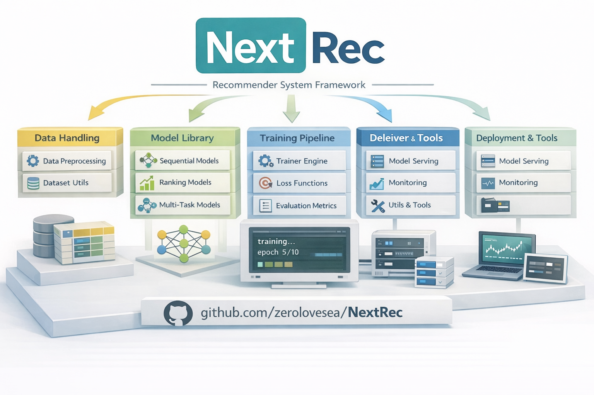

<p align="center">

<p>

<div align="center">

[](https://pypistats.org/packages/nextrec)


[](https://deepwiki.com/zerolovesea/NextRec)

中文文档 | [English Version](README_en.md)

**统一、高效、可扩展的推荐系统框架**

</div>

## 目录

- [简介](#简介)
- [NextRec进展](#NextRec进展)
- [安装](#安装)
- [架构](#架构)
- [5分钟快速上手](#5分钟快速上手)
- [命令行工具 NextRec-CLI](#命令行工具)
- [兼容平台](#兼容平台)
- [支持模型](#支持模型)
- [贡献指南](#贡献指南)

## 简介

NextRec是一个基于PyTorch的现代推荐系统框架，旨在为研究工程团队提供快速的建模、训练与评估流。框架内置丰富的模型库、数据处理工具和工程化训练组件。此外提供了易上手的接口，命令行工具及教程，推荐算法学习者能以最快速度了解模型架构，复现学术论文并进行训练和部署。

## Why NextRec
- **多场景推荐能力**：覆盖排序（CTR/CVR）、召回、多任务学习、生成式召回等推荐/营销模型，持续跟进业界进展。
- **统一的特征工程与数据流水线**：提供了统一的特征定义、可持久化的数据处理、批处理优化，符合工业大数据Spark/Hive场景下，基于离线特征的模型训练推理流程。
- **友好的工程体验**：支持多种格式数据(`csv/parquet/pathlike`)的流式处理/分布式训练/推理与可视化指标监控，方便业务算法工程师和推荐算法学习者快速复现实验。
- **灵活的命令行工具**：支持通过命令行和配置文件，一键启动训练和推理进程，方便快速实验迭代和敏捷部署。
- **丰富的模型注解**：提供了详细的模型背景介绍，实现流程，维度变化注释，方便学习者第一时间快速了解模型架构。
- **高效训练与评估**：内置多种优化器、学习率调度、早停、模型检查点与详细的日志管理（Wandb/Swanlab/Tensorboard），开箱即用。

## NextRec近期进展
- **03/02/2026** 在v0.5.3中，我们引入了NextRec Studio前端项目，初期作为NextRec CLI的配套辅助工具使用，并提供了相关[教程](nextrec_studio/README.md)
- **28/01/2026** 在v0.4.39中加入了对onnx导出和加载的支持，并大大加速了数据预处理速度（最高9x加速）
- **01/01/2026** 新年好，在v0.4.27中加入了多个多目标模型的支持：[APG](nextrec/models/multi_task/apg.py), [ESCM](nextrec/models/multi_task/escm.py), [HMoE](nextrec/models/multi_task/hmoe.py), [Cross Stitch](nextrec/models/multi_task/cross_stitch.py)
- **21/12/2025** 在v0.4.16中加入了对[GradNorm](/nextrec/loss/grad_norm.py)的支持，通过compile的`loss_weight='grad_norm'`进行配置
- **12/12/2025** 在v0.4.9中加入了[RQ-VAE](/nextrec/models/representation/rqvae.py)模块。配套的[数据集](/dataset/ecommerce_task.csv)和[代码](tutorials/notebooks/zh/使用RQ-VAE构建语义ID.ipynb)已经同步在仓库中
- **07/12/2025** 发布了NextRec CLI命令行工具，它允许用户根据配置文件进行一键训练和推理，我们提供了相关的[教程](/nextrec_cli_preset/NextRec-CLI_zh.md)和[教学代码](/nextrec_cli_preset)
- **06/12/2025** 在v0.4.1中支持了单机多卡的分布式DDP训练，并且提供了配套的[代码](tutorials/distributed)
- **11/11/2025** NextRec v0.1.0发布，我们提供了10余种Ranking模型，11种多任务模型和4种召回模型，以及统一的训练/日志/指标管理系统

## 架构

NextRec采用模块化工程设计，核心组件包括：统一特征驱动的BaseModel架构；独立Layer模块；支持训练推理的统一的DataLoader；命令行工具NextCLI等。



## 安装

开发者可以通过`pip install nextrec`快速安装NextRec的最新版本，环境要求为Python 3.10+（对于需要使用CUDA加速的开发者，建议安装对应版本的pytorch）。如果需要执行示例代码，则需要先拉取仓库：

```bash
git clone https://github.com/zerolovesea/NextRec.git
cd NextRec/
pip install nextrec # or pip install -e .
```

## 示例代码

我们在`tutorials/` 目录提供了多个示例，覆盖排序、召回、多任务、数据处理等场景：

- [movielen_ranking_deepfm.py](/tutorials/movielen_ranking_deepfm.py) - movielen 100k数据集上的 DeepFM 模型训练示例
- [example_ranking_din.py](/tutorials/example_ranking_din.py) - 电商数据集上的DIN 深度兴趣网络训练示例
- [example_multitask.py](/tutorials/example_multitask.py) - 电商数据集上的ESMM多任务学习训练示例
- [movielen_match_dssm.py](/tutorials/movielen_match_dssm.py) - 基于movielen 100k数据集训练的 DSSM 召回模型示例

- [example_onnx.py](/tutorials/example_onnx.py) - 使用NextRec训练和导出onnx模型
- [example_distributed_training.py](/tutorials/distributed/example_distributed_training.py) - 使用NextRec进行单机多卡训练的代码示例

- [run_all_ranking_models.py](/tutorials/run_all_ranking_models.py) - 快速校验所有排序模型的可用性
- [run_all_multitask_models.py](/tutorials/run_all_multitask_models.py) - 快速校验所有多任务模型的可用性
- [run_all_match_models.py](/tutorials/run_all_match_models.py) - 快速校验所有召回模型的可用性

如果想了解更多NextRec框架的细节，我们还提供了Jupyter notebook来帮助你了解：

- [如何上手NextRec框架](/tutorials/notebooks/zh/Hands%20on%20nextrec.ipynb)
- [如何使用数据处理器进行数据预处理](/tutorials/notebooks/zh/Hands%20on%20dataprocessor.ipynb)
- [使用RQ-VAE构建语义ID](/tutorials/notebooks/zh/使用RQ-VAE构建语义ID.ipynb)

## 5分钟快速上手

我们提供了详细的上手指南和配套数据集，帮助您熟悉NextRec框架的不同功能。我们在`dataset/`路径下提供了一个来自电商场景的测试数据集，数据示例如下：

| user_id | item_id | dense_0     | dense_1     | dense_2     | dense_3    | dense_4     | dense_5     | dense_6     | dense_7     | sparse_0 | sparse_1 | sparse_2 | sparse_3 | sparse_4 | sparse_5 | sparse_6 | sparse_7 | sparse_8 | sparse_9 | sequence_0                                               | sequence_1                                                | label |
|--------|---------|-------------|-------------|-------------|------------|-------------|-------------|-------------|-------------|----------|----------|----------|----------|----------|----------|----------|----------|----------|----------|-----------------------------------------------------------|-----------------------------------------------------------|-------|
| 1      | 7817    | 0.14704075  | 0.31020382  | 0.77780896  | 0.944897   | 0.62315375  | 0.57124174  | 0.77009535  | 0.3211029   | 315      | 260      | 379      | 146      | 168      | 161      | 138      | 88       | 5        | 312      | [170,175,97,338,105,353,272,546,175,545,463,128,0,0,0]   | [368,414,820,405,548,63,327,0,0,0,0,0,0,0,0]              | 0     |
| 1      | 3579    | 0.77811223  | 0.80359334  | 0.5185201   | 0.91091245 | 0.043562356 | 0.82142705  | 0.8803686   | 0.33748195 | 149      | 229      | 442      | 6        | 167      | 252      | 25       | 402      | 7        | 168      | [179,48,61,551,284,165,344,151,0,0,0,0,0,0,0]            | [814,0,0,0,0,0,0,0,0,0,0,0,0,0,0]                          | 1     |

接下来我们将用一个简短的示例，展示如何使用NextRec训练一个DIN(Deep Interest Network)模型。您也可以直接执行`python tutorials/example_ranking_din.py`来执行训练推理代码。

开始训练以后，你可以在`nextrec_logs/din_tutorial`路径下查看详细的训练日志。

```python
import pandas as pd
from nextrec.models.ranking.din import DIN
from nextrec.basic.features import DenseFeature, SparseFeature, SequenceFeature

df = pd.read_csv('dataset/ranking_task.csv')

# csv 默认将列表读取成文本，我们需要将其转化为对象
for col in df.columns:
    if 'sequence' in col:
        df[col] = df[col].apply(lambda x: eval(x) if isinstance(x, str) else x)

# 我们需要将不同特征进行定义
dense_features = [DenseFeature(name=f'dense_{i}', input_dim=1) for i in range(8)]

sparse_features = [SparseFeature(name='user_id', embedding_name='user_emb', vocab_size=int(df['user_id'].max() + 1), embedding_dim=32), SparseFeature(name='item_id', embedding_name='item_emb', vocab_size=int(df['item_id'].max() + 1), embedding_dim=32),]

sparse_features.extend([SparseFeature(name=f'sparse_{i}', embedding_name=f'sparse_{i}_emb', vocab_size=int(df[f'sparse_{i}'].max() + 1), embedding_dim=32) for i in range(10)])

sequence_features = [
    SequenceFeature(name='sequence_0', vocab_size=int(df['sequence_0'].apply(lambda x: max(x)).max() + 1), embedding_dim=32, padding_idx=0, embedding_name='item_emb'),
    SequenceFeature(name='sequence_1', vocab_size=int(df['sequence_1'].apply(lambda x: max(x)).max() + 1), embedding_dim=16, padding_idx=0, embedding_name='sequence_1_emb'),]

mlp_params = {
    "hidden_dims": [256, 128, 64],
    "activation": "relu",
    "dropout": 0.3,
}

model = DIN(
    dense_features=dense_features,
    sparse_features=sparse_features,
    sequence_features=sequence_features,
    behavior_feature_name="sequence_0",
    candidate_feature_name="item_id",
    mlp_params=mlp_params,
    attention_mlp_params={
        "hidden_dims": [80, 40],
        "activation": "sigmoid",
    },
    attention_use_softmax=True,
    target=['label'],                                   # 目标变量
    device='cpu',                                         
    session_id="din_tutorial",                            # 实验id，用于存放训练日志
)

# 编译模型，优化器/损失/学习率调度器统一在 compile 中设置
model.compile(
    optimizer="adam",
    optimizer_params={"lr": 1e-3, "weight_decay": 1e-5},
    loss="focal",
    loss_params={"gamma": 2.0, "alpha": 0.25},
)

model.fit(
    train_data=df,
    metrics=['auc', 'gauc', 'logloss'],  # 添加需要查看的指标
    epochs=3,
    batch_size=512,
    shuffle=True,
    user_id_column='user_id',            # 用于计算GAUC的id列
    valid_split=0.2,                     # 自动划分验证集（可选）
    num_workers=4,                       # DataLoader 并行数
    use_wandb=False,                     # 启用 Wandb（可选）
    wandb_kwargs={"project": "NextRec", "name": "din_tutorial"},
    use_swanlab=False,                   # 启用 SwanLab（可选）
    swanlab_kwargs={"project": "NextRec", "name": "din_tutorial"},
)

# 训练完成后进行指标评估
metrics = model.evaluate(
    df,
    metrics=['auc', 'gauc', 'logloss'],
    batch_size=512,
    user_id_column='user_id'
)
```

## 命令行工具

NextRec 提供了强大的命令行界面，支持通过 YAML 配置文件进行模型训练和预测。详细的 CLI 文档请参见：

- [NextRec CLI 使用指南](/nextrec_cli_preset/NextRec-CLI_zh.md) - 完整的 CLI 使用文档
- [NextRec CLI 配置文件示例](/nextrec_cli_preset/) - CLI 使用配置文件示例

```bash
# 训练模型
nextrec --mode=train --train_config=path/to/train_config.yaml

# 运行预测
nextrec --mode=predict --predict_config=path/to/predict_config.yaml
```

预测结果固定保存到 `{checkpoint_path}/predictions/{name}.{save_data_format}`。

> 截止当前版本0.5.19，NextRec CLI支持单机训练，分布式训练相关功能尚在开发中。

## 兼容平台

当前最新版本为0.5.19，所有模型和测试代码均已在以下平台通过验证，如果开发者在使用中遇到兼容问题，请在issue区提出错误报告及系统版本：

| 平台 | 配置 | 
|------|------|
| MacOS latest| MacBook Pro M4 Pro 24G内存 |
| Ubuntu latest| AutoDL 4070D 双卡 |
| Ubuntu 24.04| NVIDIA TITAN V 5卡 |
| CentOS 7 | Intel Xeon 5138Y 96核 377G内存 | 

## 支持模型

### 排序模型

| 模型 | 论文 | 状态 |
| ------ | ------ | ------ |
| [FM](nextrec/models/ranking/fm.py) | Factorization machines | 已支持 |
| [LR](nextrec/models/ranking/lr.py) | Applied Logistic Regression | 已支持 |
| [AFM](nextrec/models/ranking/afm.py) | Attentional Factorization Machines: Learning the Weight of Feature Interactions via Attention Networks | 已支持 |
| [FFM](nextrec/models/ranking/ffm.py) | Field-aware Factorization Machines for CTR Prediction | 已支持 |
| [DeepFM](nextrec/models/ranking/deepfm.py) | DeepFM: A factorization-machine based neural network for CTR prediction | 已支持 |
| [NFM](nextrec/models/ranking/nfm.py) | Neural factorization machines for sparse predictive analytics | 已支持 |
| [Wide&Deep](nextrec/models/ranking/widedeep.py) | Wide & Deep learning for recommender systems | 已支持 |
| [xDeepFM](nextrec/models/ranking/xdeepfm.py) | xdeepfm: Combining explicit and implicit feature interactions for recommender systems | 已支持 |
| [FiBiNET](nextrec/models/ranking/fibinet.py) | FiBiNET: Combining feature importance and bilinear feature interaction for click-through rate prediction | 已支持 |
| [PNN](nextrec/models/ranking/pnn.py) | Product-based neural networks for user response prediction | 已支持 |
| [AutoInt](nextrec/models/ranking/autoint.py) | AutoInt: Automatic feature interaction learning via self-attentive neural networks | 已支持 |
| [DCN](nextrec/models/ranking/dcn.py) | Deep & cross network for ad click predictions | 已支持 |
| [DCN v2](nextrec/models/ranking/dcn_v2.py) | DCN V2: Improved Deep & Cross Network and Practical Lessons for Web-scale Learning to Rank Systems | 已支持 |
| [DIN](nextrec/models/ranking/din.py) | Deep interest network for click-through rate prediction | 已支持 |
| [DIEN](nextrec/models/ranking/dien.py) | Deep interest evolution network for click-through rate prediction | 已支持 |
| [MaskNet](nextrec/models/ranking/masknet.py) | MaskNet: Introducing Feature-Wise Multiplication to CTR Ranking Models by Instance-Guided Mask | 已支持 |
| [EulerNet](nextrec/models/ranking/eulernet.py) | EulerNet: Efficient and Effective Feature Interaction Modeling with Euler's Formula | 已支持 |

### 召回模型

| 模型 | 论文 | 状态 |
| ------ | ------ | ------ |
| [DSSM](nextrec/models/retrieval/dssm.py) | Learning deep structured semantic models for web search using clickthrough data | 已支持 |
| [DSSM v2](nextrec/models/retrieval/dssm_v2.py) | DSSM v2 - DSSM with pairwise training using BPR loss | 已支持 |
| [YouTube DNN](nextrec/models/retrieval/youtube_dnn.py) | Deep neural networks for youtube recommendations | 已支持 |
| [MIND](nextrec/models/retrieval/mind.py) | Multi-interest network with dynamic routing for recommendation at Tmall | 已支持 |
| [SDM](nextrec/models/retrieval/sdm.py) | Sequential recommender system based on hierarchical attention networks | 已支持 |

### 序列推荐模型

| 模型 | 论文 | 状态 |
| ------ | ------ | ------ |
| [SASRec](nextrec/models/sequential/sasrec.py) | Self-Attentive Sequential Recommendation | 开发中 |
| [HSTU](nextrec/models/sequential/hstu.py) | Actions speak louder than words: Trillion-parameter sequential transducers for generative recommendations | 已支持 |

### 多任务模型

| 模型 | 论文 | 状态 |
| ------ | ------ | ------ |
| [MMOE](nextrec/models/multi_task/mmoe.py) | Modeling Task Relationships in Multi-task Learning with Multi-gate Mixture-of-Experts | 已支持 |
| [PLE](nextrec/models/multi_task/ple.py) | Progressive Layered Extraction (PLE): A Novel Multi-Task Learning (MTL) Model for Personalized Recommendations | 已支持 |
| [ESMM](nextrec/models/multi_task/esmm.py) | Entire Space Multi-Task Model: An Effective Approach for Estimating Post-Click Conversion Rate | 已支持 |
| [ShareBottom](nextrec/models/multi_task/share_bottom.py) | Multitask Learning | 已支持 |
| [POSO](nextrec/models/multi_task/poso.py) | POSO: Personalized Cold Start Modules for Large-scale Recommender Systems | 已支持 |
| [PEPNet](nextrec/models/multi_task/pepnet.py) | PEPNet: Parameter and Embedding Personalized Network for Infusing with Personalized Prior Information | 已支持 |
| [APG](nextrec/models/multi_task/apg.py) | APG: Adaptive Parameter Generation Network for Click-Through Rate Prediction | 已支持 |
| [CrossStitch](nextrec/models/multi_task/cross_stitch.py) | Cross-Stitch Networks for Multi-Task Learning | 已支持 |
| [HMOE](nextrec/models/multi_task/hmoe.py) | Improving multi-scenario learning to rank in e-commerce by exploiting task relationships in the label space | 已支持 |
| [SNRTrans](nextrec/models/multi_task/snr_trans.py) | SNR: Sub-Network Routing for Flexible Parameter Sharing in Multi-Task Learning in E-Commerce by Exploiting Task Relationships in the Label Space | 已支持 |
| [AITM](nextrec/models/multi_task/aitm.py) | Modeling the Sequential Dependence among Audience Multi-step Conversions with Multi-task Learning in Targeted Display Advertising | 已支持 |

### 树模型

| 模型 | 说明 | 状态 |
| ------ | ------ | ------ |
| [XGBoost](nextrec/models/tree_base/xgboost.py) | XGBoost adapter (requires `xgboost`) | 已支持 |
| [LightGBM](nextrec/models/tree_base/lightgbm.py) | LightGBM adapter (requires `lightgbm`) | 已支持 |
| [CatBoost](nextrec/models/tree_base/catboost.py) | CatBoost adapter (requires `catboost`) | 已支持 |

### 生成式模型

| 模型 | 论文 | 状态 |
| ------ | ------ | ------ |
| [TIGER](nextrec/models/generative/tiger.py) | Recommender Systems with Generative Retrieval | 开发中 |

### 表征模型

| 模型 | 论文 | 状态 |
| ------ | ------ | ------ |
| [RQ-VAE](nextrec/models/representation/rqvae.py) | Autoregressive Image Generation using Residual Quantization | 已支持 |
| [BPR](nextrec/models/representation/bpr.py) | Bayesian Personalized Ranking | 开发中 |
| [MF](nextrec/models/representation/mf.py) | Matrix Factorization Techniques for Recommender Systems | 开发中 |
| [AutoRec](nextrec/models/representation/autorec.py) | AutoRec: Autoencoders Meet Collaborative Filtering | 开发中 |
| [LightGCN](nextrec/models/representation/lightgcn.py) | LightGCN: Simplifying and Powering Graph Convolution Network for Recommendation | 开发中 |
| [S3Rec](nextrec/models/representation/s3rec.py) | S3-Rec: Self-Supervised Learning for Sequential Recommendation | 开发中 |
| [CL4SRec](nextrec/models/representation/cl4srec.py) | CL4SRec: Contrastive Learning for Sequential Recommendation | 开发中 |

---

## 贡献指南

我们欢迎任何形式的贡献！

### 如何贡献

1. Fork 本仓库
2. 创建特性分支 (`git checkout -b feature/AmazingFeature`)
3. 提交更改 (`git commit -m 'Add some AmazingFeature'`)
4. 推送到分支 (`git push origin feature/AmazingFeature`)
5. 创建 Pull Request

> 在提交 PR 之前，请运行 `python test/run_tests.py` 和 `python scripts/format_code.py` 确保所有测试通过并统一代码风格。

### 代码规范

- 遵循 PEP 8 Python 代码风格
- 为新增功能补充单元测试
- 同步更新相关文档

### 报告错误

在 [Issues](https://github.com/zerolovesea/NextRec/issues) 页面提交问题时，请包含：

- 错误描述
- 重现步骤
- 期望行为
- 实际行为
- 环境信息（Python 版本、PyTorch 版本等）

## 许可证

本项目采用 [Apache 2.0 许可证](./LICENSE)。

## 联系方式

- **GitHub Issues**: [提交问题](https://github.com/zerolovesea/NextRec/issues)
- **邮箱**: zyaztec@gmail.com

## 致谢

NextRec 的开发受到以下优秀项目的启发：

- [torch-rechub](https://github.com/datawhalechina/torch-rechub) - 灵活且易于扩展的推荐系统框架
- [FuxiCTR](https://github.com/reczoo/FuxiCTR) - 可配置、可调优、可复现的 CTR 预测库
- [RecBole](https://github.com/RUCAIBox/RecBole) - 统一、全面、高效的推荐库

感谢开源社区的所有贡献者！


## 引用

如果您在研究或工作中使用了本框架，欢迎引用本项目：

```bibtex
@misc{nextrec,
    title = {NextRec},
    author = {Yang Zhou},
    year = {2026},
    publisher = {GitHub},
    journal = {GitHub repository},
    howpublished = {\url{https://github.com/zerolovesea/NextRec}},
    note = {A unified, efficient, and extensible PyTorch-based recommendation library}
}
```
---

<div align="center">

**[返回顶部](#nextrec)**

</div>
