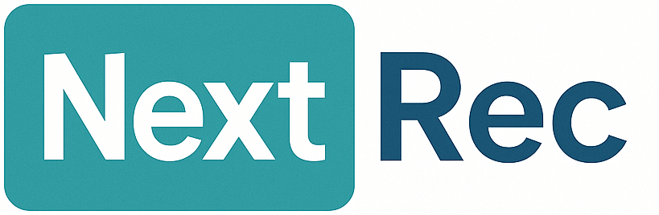
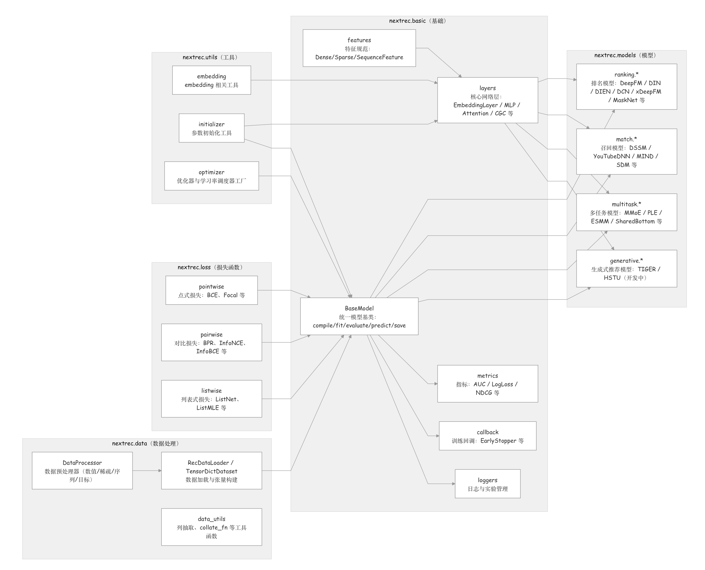

<p align="center">

<p>

<div align="center">


[English Version](README.md) | 中文文档

**统一、高效、可扩展的推荐系统框架**

</div>

## 简介

NextRec 是一个基于 PyTorch 构建的现代推荐系统框架，为研究人员与工程团队提供统一的建模、训练与评估体验。框架采用模块化设计，内置丰富的模型实现、数据处理工具和工程化训练组件，可快速覆盖多种推荐场景，主要面向Spark集群下，基于大数据量parquet离线特征训练的工业推荐召回算法场景。

## Why NextRec

- **统一的特征工程与数据流水线**：NextRec框架提供了 Dense/Sparse/Sequence 特征定义、可持久化的 DataProcessor、批处理优化的 RecDataLoader，符合工业大数据场景下，基于离线特征的模型训练推理流程。
- **多场景推荐能力**：同时覆盖排序（CTR/CVR）、召回、多任务学习等推荐/营销模型，并且持续扩充模型库中。
- **友好的工程体验**：NextRec框架支持各种格式数据(csv/parquet/pathlike)的流式处理/训练/推理，并支持 GPU/MPS 加速与可视化监控。
- **高效训练与评估**：NextRec框架的标准化训练引擎内置多种优化器、学习率调度、早停、模型检查点与详细的日志管理，开箱即用。

## 架构

NextRec采用模块化、低耦合的工程设计，使得推荐系统从数据处理 → 模型构建 → 训练评估 → 推理部署 全链路都具备复用性与可扩展性。其中的核心组件包括：Feature Spec驱动的Embedding架构；模型基类BaseModel；独立Layer模块；支持训练和推理的统一的DataLoader；开箱即用的模型库。



> 项目的架构借鉴了一些优秀的开源推荐算法库，其中最初版的layer层借鉴了DataWhaleChina社区的[torch-rechub](https://github.com/datawhalechina/torch-rechub)，现已替换为了自有实现。torch-rechub在开发架构和模型实现上相对成熟，本人也参与了其中一小部分的维护，欢迎感兴趣的开发者前往了解。

---

## 安装

你可以通过`pip install nextrec`快速安装NextRec的最新版本，环境要求为Python 3.10+。

## 示例代码

我们在`tutorials/` 目录提供了多个示例，覆盖排序、召回、多任务、数据处理等场景：

- [movielen_ranking_deepfm.py](/tutorials/movielen_ranking_deepfm.py) - movielen 100k数据集上的 DeepFM 模型训练示例
- [example_ranking_din.py](/tutorials/example_ranking_din.py) - 电商数据集上的DIN 深度兴趣网络训练示例
- [example_multitask.py](/tutorials/example_multitask.py) - 电商数据集上的ESMM多任务学习训练示例
- [movielen_match_dssm.py](/tutorials/example_match_dssm.py) - 基于movielen 100k数据集训练的 DSSM 召回模型示例

如果想了解更多NextRec框架的细节，我们还提供了Jupyter notebook来帮助你了解：

- [如何上手NextRec框架](/tutorials/notebooks/zh/Hands%20on%20nextrec.ipynb)
- [如何使用数据处理器进行数据预处理](/tutorials/notebooks/zh/Hands%20on%20dataprocessor.ipynb)

> 当前版本[0.3.6]，召回模型模块尚不完善，可能存在一些兼容性问题或意外报错，如果遇到问题，欢迎开发者在Issue区提出问题。

## 5分钟快速上手

我们提供了详细的上手指南和配套数据集，帮助您熟悉NextRec框架的不同功能。我们在`datasets/`路径下提供了一个来自电商场景的测试数据集，数据示例如下：

| user_id | item_id | dense_0     | dense_1     | dense_2     | dense_3    | dense_4     | dense_5     | dense_6     | dense_7     | sparse_0 | sparse_1 | sparse_2 | sparse_3 | sparse_4 | sparse_5 | sparse_6 | sparse_7 | sparse_8 | sparse_9 | sequence_0                                               | sequence_1                                                | label |
|--------|---------|-------------|-------------|-------------|------------|-------------|-------------|-------------|-------------|----------|----------|----------|----------|----------|----------|----------|----------|----------|----------|-----------------------------------------------------------|-----------------------------------------------------------|-------|
| 1      | 7817    | 0.14704075  | 0.31020382  | 0.77780896  | 0.944897   | 0.62315375  | 0.57124174  | 0.77009535  | 0.3211029   | 315      | 260      | 379      | 146      | 168      | 161      | 138      | 88       | 5        | 312      | [170,175,97,338,105,353,272,546,175,545,463,128,0,0,0]   | [368,414,820,405,548,63,327,0,0,0,0,0,0,0,0]              | 0     |
| 1      | 3579    | 0.77811223  | 0.80359334  | 0.5185201   | 0.91091245 | 0.043562356 | 0.82142705  | 0.8803686   | 0.33748195 | 149      | 229      | 442      | 6        | 167      | 252      | 25       | 402      | 7        | 168      | [179,48,61,551,284,165,344,151,0,0,0,0,0,0,0]            | [814,0,0,0,0,0,0,0,0,0,0,0,0,0,0]                          | 1     |

接下来我们将用一个简短的示例，展示如何使用NextRec训练一个DIN模型。DIN(Deep Interest Network)来自于阿里妈妈2018年KDD最佳论文模型，用于CTR预估场景。你也可以直接执行`python tutorials/example_ranking_din.py`来执行训练推理代码。

开始训练以后，你可以在`nextrec_logs/din_tutorial`路径下查看详细的训练日志。

```python
import pandas as pd
from nextrec.models.ranking.din import DIN
from nextrec.basic.features import DenseFeature, SparseFeature, SequenceFeature

df = pd.read_csv('dataset/ranking_task.csv')

for col in df.columns and 'sequence' in col: # csv默认将列表读取成文本，我们需要将其转化为对象
    df[col] = df[col].apply(lambda x: eval(x) if isinstance(x, str) else x)

# 我们需要将不同特征进行定义
dense_features = [DenseFeature(name=f'dense_{i}', input_dim=1) for i in range(8)]

sparse_features = [SparseFeature(name='user_id', embedding_name='user_emb', vocab_size=int(df['user_id'].max() + 1), embedding_dim=32), SparseFeature(name='item_id', embedding_name='item_emb', vocab_size=int(df['item_id'].max() + 1), embedding_dim=32),]

sparse_features.extend([SparseFeature(name=f'sparse_{i}', embedding_name=f'sparse_{i}_emb', vocab_size=int(df[f'sparse_{i}'].max() + 1), embedding_dim=32) for i in range(10)])

sequence_features = [
    SequenceFeature(name='sequence_0', vocab_size=int(df['sequence_0'].apply(lambda x: max(x)).max() + 1), embedding_dim=32, padding_idx=0, embedding_name='item_emb'),
    SequenceFeature(name='sequence_1', vocab_size=int(df['sequence_1'].apply(lambda x: max(x)).max() + 1), embedding_dim=16, padding_idx=0, embedding_name='sparse_0_emb'),]

mlp_params = {
    "dims": [256, 128, 64],
    "activation": "relu",
    "dropout": 0.3,
}

model = DIN(
    dense_features=dense_features,
    sparse_features=sparse_features,
    sequence_features=sequence_features,
    mlp_params=mlp_params,
    attention_hidden_units=[80, 40],
    attention_activation='sigmoid',
    attention_use_softmax=True,
    target=['label'],                                     # 目标变量
    device='mps',                                         
    embedding_l1_reg=1e-6,
    embedding_l2_reg=1e-5,
    dense_l1_reg=1e-5,
    dense_l2_reg=1e-4,
    session_id="din_tutorial",                            # 实验id，用于存放训练日志
)

# 编译模型，设置优化器和损失函数
model.compile(
            optimizer = "adam",
            optimizer_params = {"lr": 1e-3, "weight_decay": 1e-5},
            loss = "focal",
            loss_params={"gamma": 2.0, "alpha": 0.25},
        )

model.fit(
    train_data=df,
    metrics=['auc', 'gauc', 'logloss'],  # 添加需要查看的指标
    epochs=3,
    batch_size=512,
    shuffle=True,
    user_id_column='user_id'             # 用于计算GAUC的id列 
)

# 训练完成后进行指标评估
metrics = model.evaluate(
    df,
    metrics=['auc', 'gauc', 'logloss'],
    batch_size=512,
    user_id_column='user_id'
)
```

## 支持模型

### 排序模型

| 模型 | 论文 | 年份 | 状态 |
|------|------|------|------|
| [FM](nextrec/models/ranking/fm.py) | Factorization Machines | ICDM 2010 | 已支持 |
| [AFM](nextrec/models/ranking/afm.py) | Attentional Factorization Machines: Learning the Weight of Feature Interactions via Attention Networks | IJCAI 2017 | 已支持 |
| [DeepFM](nextrec/models/ranking/deepfm.py) | DeepFM: A Factorization-Machine based Neural Network for CTR Prediction | IJCAI 2017 | 已支持 |
| [Wide&Deep](nextrec/models/ranking/widedeep.py) | Wide & Deep Learning for Recommender Systems | DLRS 2016 | 已支持 |
| [xDeepFM](nextrec/models/ranking/xdeepfm.py) | xDeepFM: Combining Explicit and Implicit Feature Interactions | KDD 2018 | 已支持 |
| [FiBiNET](nextrec/models/ranking/fibinet.py) | FiBiNET: Combining Feature Importance and Bilinear Feature Interaction for CTR Prediction | RecSys 2019 | 已支持 |
| [PNN](nextrec/models/ranking/pnn.py) | Product-based Neural Networks for User Response Prediction | ICDM 2016 | 已支持 |
| [AutoInt](nextrec/models/ranking/autoint.py) | AutoInt: Automatic Feature Interaction Learning | CIKM 2019 | 已支持 |
| [DCN](nextrec/models/ranking/dcn.py) | Deep & Cross Network for Ad Click Predictions | ADKDD 2017 | 已支持 |
| [DCN v2](nextrec/models/ranking/dcn_v2.py) | DCN V2: Improved Deep & Cross Network and Practical Lessons for Web-scale Learning to Rank Systems | KDD 2021 | 开发中 |
| [DIN](nextrec/models/ranking/din.py) | Deep Interest Network for Click-Through Rate Prediction | KDD 2018 | 已支持 |
| [DIEN](nextrec/models/ranking/dien.py) | Deep Interest Evolution Network for Click-Through Rate Prediction | AAAI 2019 | 已支持 |
| [MaskNet](nextrec/models/ranking/masknet.py) | MaskNet: Introducing Feature-wise Gating Blocks for High-dimensional Sparse Recommendation Data | 2020 | 已支持 |

### 召回模型

| 模型 | 论文 | 年份 | 状态 |
|------|------|------|------|
| [DSSM](nextrec/models/match/dssm.py) | Learning Deep Structured Semantic Models | CIKM 2013 | 已支持 |
| [DSSM v2](nextrec/models/match/dssm_v2.py) | DSSM with pairwise BPR-style optimization | - | 已支持 |
| [YouTube DNN](nextrec/models/match/youtube_dnn.py) | Deep Neural Networks for YouTube Recommendations | RecSys 2016 | 已支持 |
| [MIND](nextrec/models/match/mind.py) | Multi-Interest Network with Dynamic Routing | CIKM 2019 | 已支持 |
| [SDM](nextrec/models/match/sdm.py) | Sequential Deep Matching Model | - | 已支持 |

### 多任务模型

| 模型 | 论文 | 年份 | 状态 |
|------|------|------|------|
| [MMOE](nextrec/models/multi_task/mmoe.py) | Modeling Task Relationships in Multi-task Learning | KDD 2018 | 已支持 |
| [PLE](nextrec/models/multi_task/ple.py) | Progressive Layered Extraction | RecSys 2020 | 已支持 |
| [ESMM](nextrec/models/multi_task/esmm.py) | Entire Space Multi-Task Model | SIGIR 2018 | 已支持 |
| [ShareBottom](nextrec/models/multi_task/share_bottom.py) | Multitask Learning | - | 已支持 |
| [POSO](nextrec/models/multi_task/poso.py) | POSO: Personalized Cold-start Modules for Large-scale Recommender Systems | 2021 | 已支持 |
| [POSO-IFLYTEK](nextrec/models/multi_task/poso_iflytek.py) | POSO with PLE-style gating for sequential marketing tasks | - | 已支持 |

### 生成式模型

| 模型 | 论文 | 年份 | 状态 |
|------|------|------|------|
| [TIGER](nextrec/models/generative/tiger.py) | Recommender Systems with Generative Retrieval | NeurIPS 2023 | 开发中 |
| [HSTU](nextrec/models/generative/hstu.py) | Hierarchical Sequential Transduction Units | - | 开发中 |

---

## 贡献指南

我们欢迎任何形式的贡献！

### 如何贡献

1. Fork 本仓库
2. 创建特性分支 (`git checkout -b feature/AmazingFeature`)
3. 提交更改 (`git commit -m 'Add some AmazingFeature'`)
4. 推送到分支 (`git push origin feature/AmazingFeature`)
5. 创建 Pull Request

> 在提交 PR 之前，请运行 `python test/run_tests.py` 确保所有测试通过。

### 代码规范

- 遵循 PEP 8 Python 代码风格
- 为新增功能补充单元测试
- 同步更新相关文档

### 报告错误

在 [Issues](https://github.com/zerolovesea/NextRec/issues) 页面提交问题时，请包含：

- 错误描述
- 重现步骤
- 期望行为
- 实际行为
- 环境信息（Python 版本、PyTorch 版本等）

---

## 许可证

本项目采用 [Apache 2.0 许可证](./LICENSE)。

---

## 联系方式

- **GitHub Issues**: [提交问题](https://github.com/zerolovesea/NextRec/issues)
- **邮箱**: zyaztec@gmail.com

---

## 致谢

NextRec 的开发受到以下优秀项目的启发：

- [torch-rechub](https://github.com/datawhalechina/torch-rechub) - 灵活且易于扩展的推荐系统框架
- [FuxiCTR](https://github.com/reczoo/FuxiCTR) - 可配置、可调优、可复现的 CTR 预测库
- [RecBole](https://github.com/RUCAIBox/RecBole) - 统一、全面、高效的推荐库

感谢开源社区的所有贡献者！

---

<div align="center">

**[返回顶部](#nextrec)**

</div>
