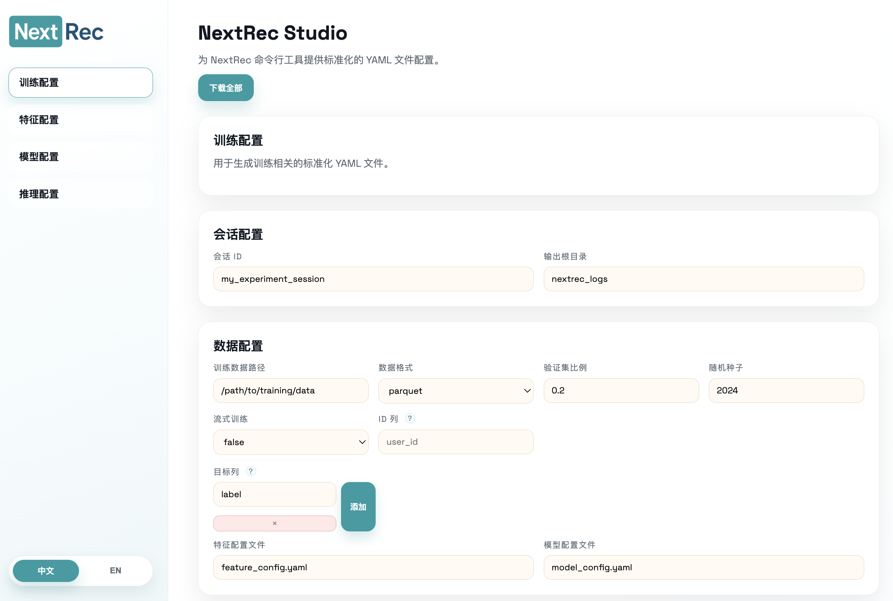
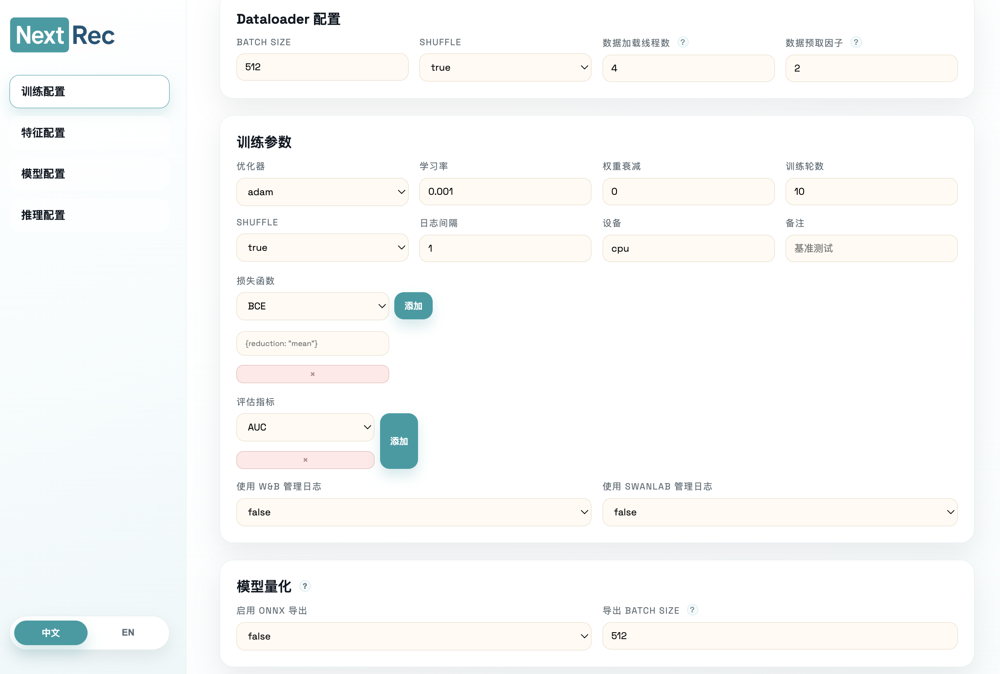
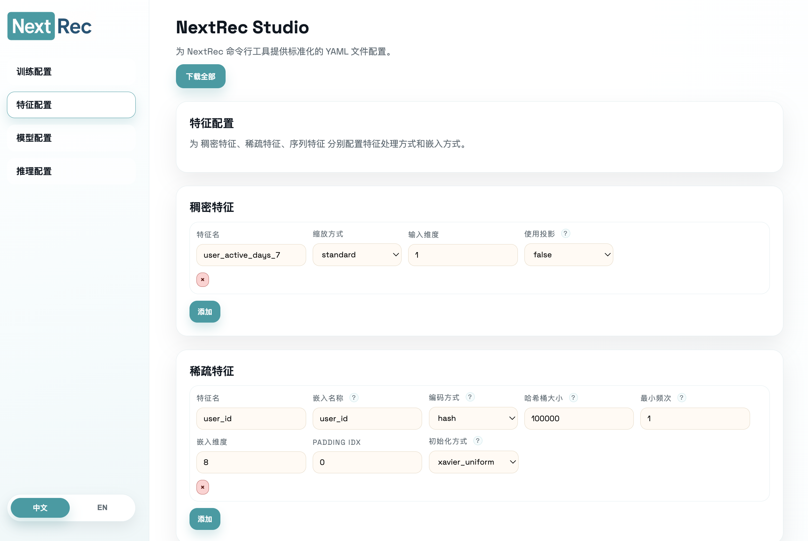
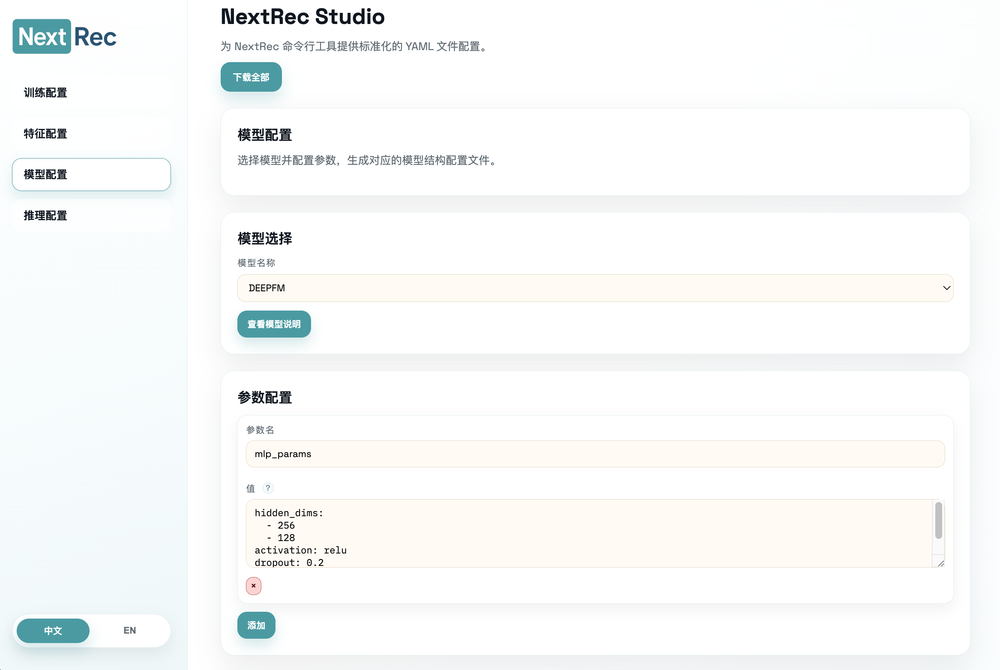
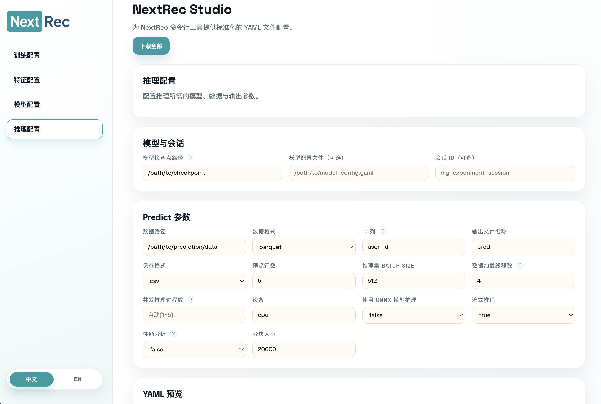

# NextRec Studio

NextRec CLI使用配置文件来调整需要的参数，不过使用中可能存在格式不准确导致的配置错误。对于这种情况，可以使用 NextRec Studio，一个基于 Vue3 的前端项目，来可视化的配置 NextRec CLI 训练/特征/模型/推理 文件。

<div style="display: flex; gap: 10px;">
  
  
</div>

<div style="display: flex; gap: 10px;">
  
  
</div>

<div style="display: flex; gap: 10px;">
  
</div>

## 你可以用它做什么

- 分页面配置：训练 / 特征 / 模型 / 推理
- 辅助理解模型参数含义
- 下载生成的 YAML 文件，直接给 CLI 使用

## 启动方式

Studio 项目位于仓库 `nextrec_studio/`，支持：

- 脚本启动：`./start_nextrec_studio.sh`
- Dockerfile
- Docker Compose

启动后默认访问：`http://localhost:15173`

## 与 CLI 配合

1. 在网页里配置并下载 YAML
2. 在命令行运行：

```bash
nextrec --mode=train --train_config train_config.yaml
nextrec --mode=predict --predict_config predict_config.yaml
```

